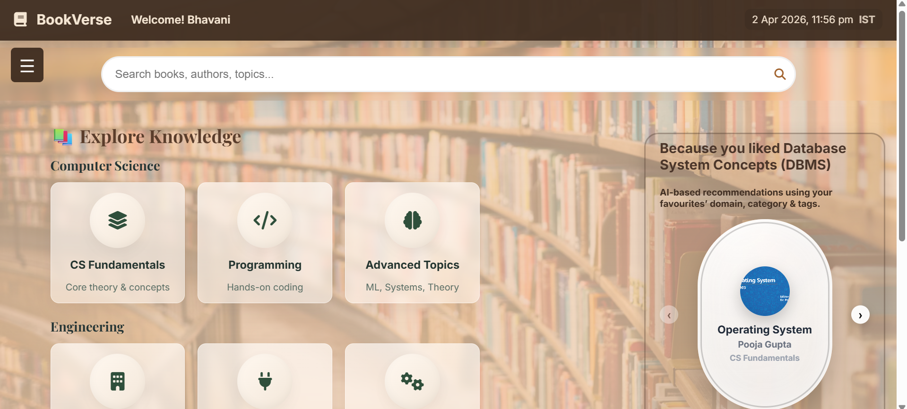
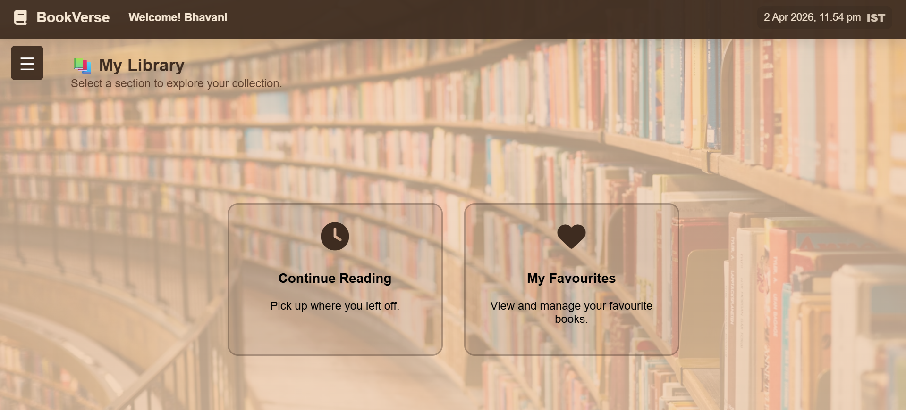

# 📚 BookVerse – Smart AI Digital Library

BookVerse is a modern digital library web application that allows users to explore, manage, and personalize their reading experience. Built with a clean UI and powered by Firebase, it provides real-time updates, authentication, and intelligent book recommendations.

🔗 Live Demo: https://bookverse-hub.vercel.app/  
🔗 GitHub Repo: https://github.com/Bandi-krupa-Bhavani/BOOKVERSE_SMART_AI_DIGITAL_LIBRARY  

---

## 🚀 Features

### 🔐 Authentication
- Firebase Email/Password login
- Google Sign-in integration
- Secure user session handling

### 📊 Dashboard
- Elegant brown-themed UI
- Sticky header with sidebar navigation
- Category-based exploration (CS, Programming, Mechanical, etc.)

### 📖 My Library
- Save and manage books
- Real-time sync using Firebase Firestore
- LocalStorage fallback support

### ⭐ Favourites
- Add/remove favourite books
- Instant UI updates with Firestore listeners

### 📘 Continue Reading
- Tracks reading progress
- Seamless cross-device experience
- Auto-sync with database

### 🎯 Smart Recommendations
- “Because you liked…” suggestions
- Based on user favourites (author, tags, domain)
- Dynamic real-time updates

### 📚 Domain-Based Pages
- Organized categories like:
  - CS Fundamentals
  - Programming
  - Advanced Topics
- Fast search with responsive card layout

### 🎉 Welcome Experience
- Motivational popup on login
- Random images and quotes

### 📄 PDF Reader
- Built-in PDF viewing

---

## 🛠️ Tech Stack

**Frontend**
- HTML
- CSS
- JavaScript

**Backend / Services**
- Firebase Authentication
- Firebase Firestore

**Deployment**
- Vercel

**Other Tools**
- Font Awesome (icons)
- Google Fonts (Inter, Playfair Display)

---

## 📸 Screenshots

### 🏠 Home Page


### 📊 Dashboard


### 📚 popup


### 📘 library


---

## ⚙️ Setup Instructions

### 1️⃣ Clone the repository
```bash
git clone https://github.com/Bandi-krupa-Bhavani/BOOKVERSE_SMART_AI_DIGITAL_LIBRARY.git
cd BOOKVERSE_SMART_AI_DIGITAL_LIBRARY
